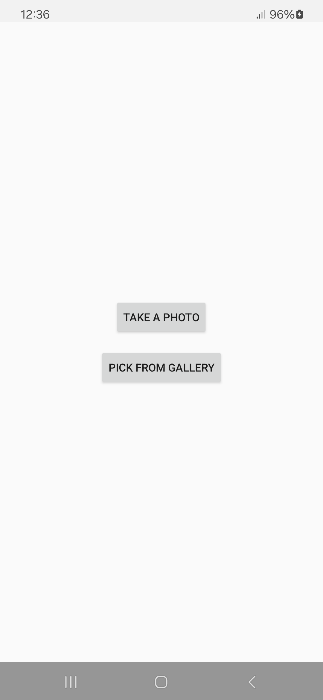
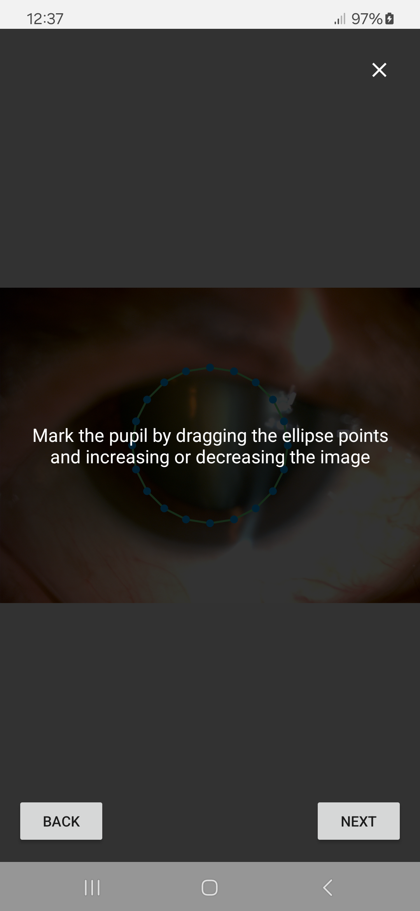
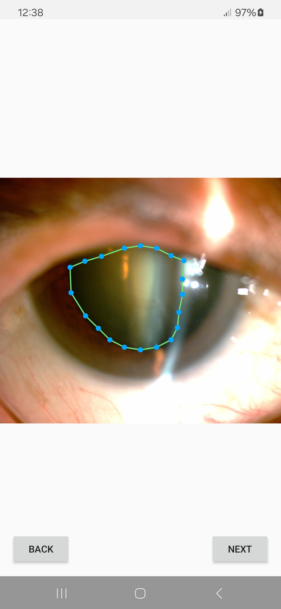
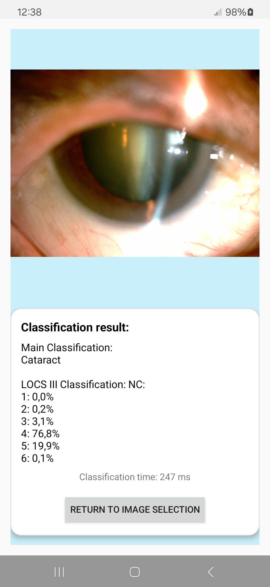
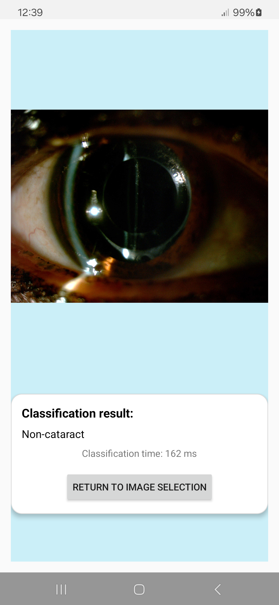
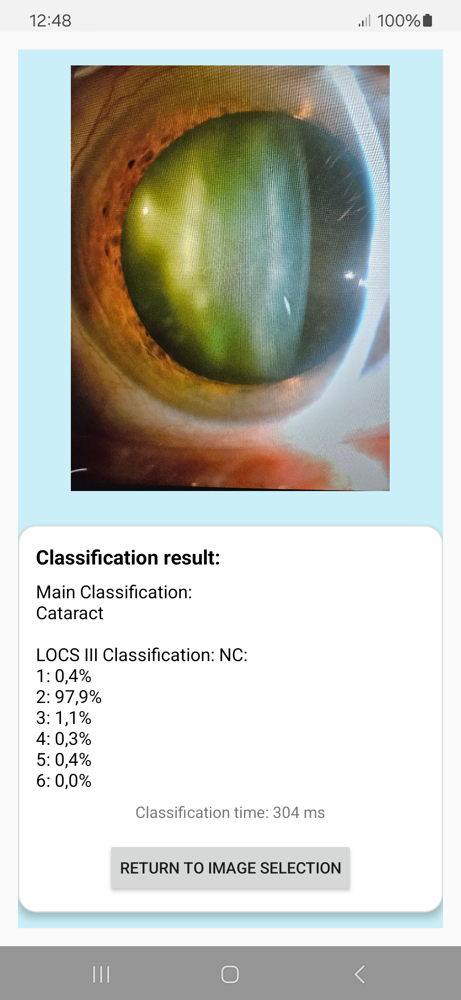

# AI-Powered Mobile App for Nuclear Cataract Detection

This Android mobile application is part of the research described in the accompanying scientific article.  
Author: Alicja Ignatowicz
Supervision: Tomasz Marciniak

It implements a deep learning–based classifier to support the assessment of cataracts using ocular images.

>The study utilizes the [The Nuclear Cataract Database for Biomedical and Machine Learning Applications](https://data.mendeley.com/datasets/6wv33nbcvv/2) classified using LOCS III and proposes a mobile inference pipeline that incorporates pupil marking, preprocessing, and classification into one user-friendly tool.

<b> Authors </b> : Alicja Ignaczowicz, Tomasz Marciniak, Elżbieta Marciniak

## Dataset 
Dataset is selected from [The Nuclear Cataract Database for Biomedical and Machine Learning Applications](https://data.mendeley.com/datasets/6wv33nbcvv/2). Detailed list of selected files is given in

## Extraction of region-of-interest (ROI) and image preprocessing

Preprocessing steps: 
- manual extraction of pupil region,
- cropping, ensuring proper centering,
- resized 224x224.

## Binary classification and neural network model conversion to TensorFlow Lite
The classification involves binary anomaly detection via autoencoder, followed by CNN classification.
The trained model was first saved as **`model.pth`** (PyTorch), it had been optimised to **`model.tflite`** for use on mobile devices.
Among all tested architectures, **VGG11** achieved the best accuracy after conversion to TFLite, so this variant was selected for the nuclear-cataract classifier in the Android app.

## Android-Based Application

The app allows users to:

1. Select from the gallery or capture an eye image.
2. Mark the pupil region using a draggable ellipse with control points.
3. Automatically extract the pupil area and perform classification using an embedded deep learning model (`vgg11.tflite`).
4. Display the classification result and classification time on-screen.

The application performs all inference **locally on-device** (no internet required), and supports real-time testing of the proposed method in the article.

## User interface

<table>
  <tr>
    <td align="center">
       
      <b>Image selection (gallery or camera)</b>
    </td>
    <td align="center">
       
      <b>Instruction shown before pupil marking</b>
    </td>
    <td align="center">
       
      <b>After pupil marking using ellipse</b>
    </td>
  </tr>
    <td align="center">
       
      <b>Classification result (Cataract)</b>
    </td>
    <td align="center">
       
      <b>Classification result (Non-Cataract)</b>
    </td>
      <td align="center">
       
      <b>Classification result after taking a photo to classify </b>
    </td>
  </tr>
</table>

## Download APK 

> ⚠️ Disclaimer - v1.0.0 - This is an early prototype of the application for academic research only. It's not optimized for production, and the APK file size is large (~700 MB) because it includes an uncompressed deep learning model.
v1.0.0 - [ Download AICataractDetector.apk](https://www.dropbox.com/scl/fi/14u5210c25b0urh24adnx/AICataractDetector.apk?rlkey=40nl7ml86db169dkjybrdbmd0&st=z117w112&dl=0)

To install the app on Android, allow installations from unknown sources in settings.

## License and Disclaimer

This application is intended for research and academic demonstration purposes only. It is **not a certified medical diagnostic tool** and should not be used for clinical decision-making.

## Citation
Ignatowicz A.;Marciniak T.; Marciniak E., AI-Powered Mobile App for Cataract Detection - <b>To be published</b>
